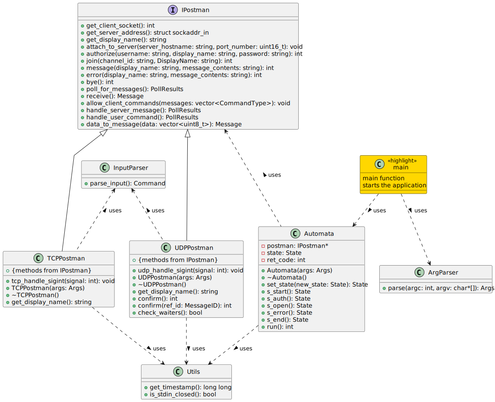
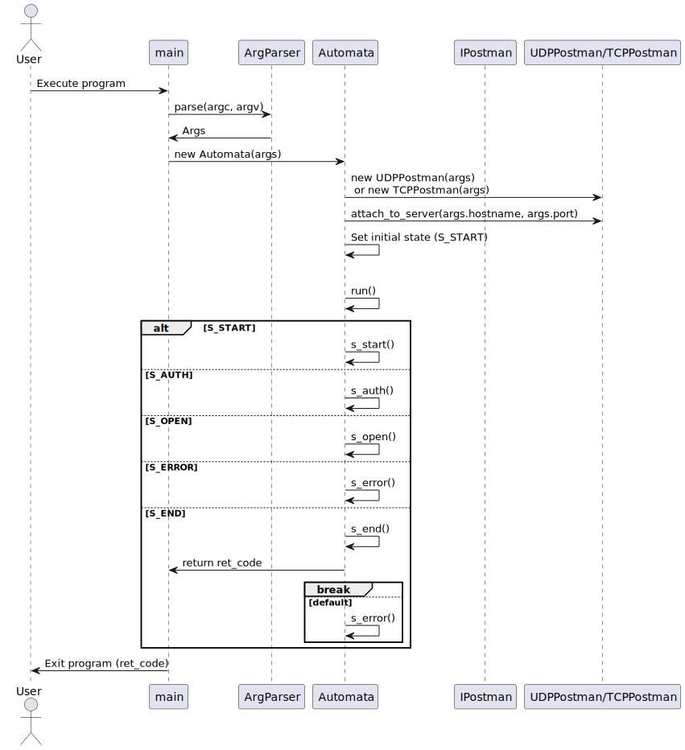
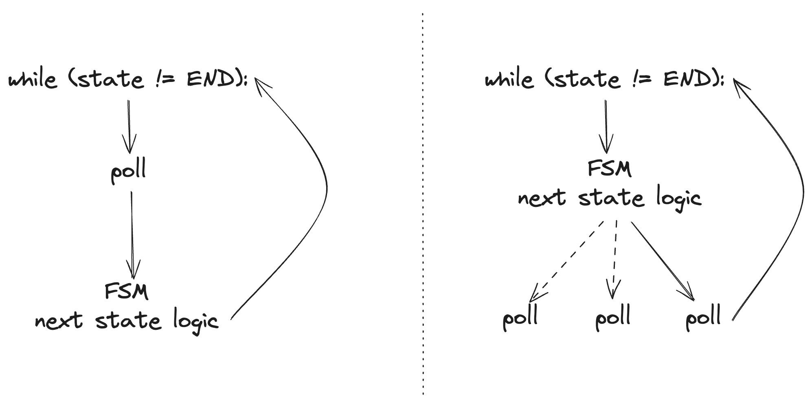
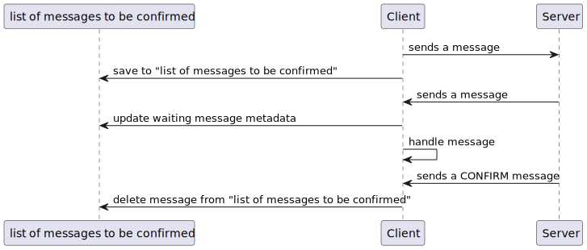

# IPK projekt 01 - 2023/24

Autor: **Tomáš Hobza** (`xhobza03`)

**2024 @ FIT VUT**

---

## 👋 Úvod

Tato dokumentace popisuje moji implementace prvního projektu z předmětu IPK. Projekt představuje chatovací aplikaci, kde komunikace pracuje na bázi protokolů UDP a TCP, na nichž navíc implementuje další vrstvu. Projekt je implementovaný v jazyce C++ a to na principu objektově orientovaného programování. Všechny třídy jsou takzvané „singletony“ - třídy, které jsou realizovány právě jednou instancí. Dokumentace je psaná „top-down“ přístupem, kdy přímo v popisu implementace popíšu i nutnou teorii potřebnou k implementaci projektu.


Pro jednodušší orientaci jsem vytvořil diagram vztahu mezi třídami mé implementace.



*Popisek: Diagram vztahu mezi třídami celého projektu*


## 🧠 Hlavní mozek programu



*Popisek: Sekvenční diagram zachycující hlavní logiku programu*

### 🔑 Funkce `main`

Program začíná analýzou argumentů z příkazové řádky - argumentů programu samotného. K tomu použije třídu `ArgParser`, která obsahuje metodu právě pro tento účel. Získávání argumentů a jejich hodnot je implementováno pomocí funkce `getopt`. Samotná analýza těchto argumentů moc zajímavá není - za zmínku tak stojí pouze kontrola zda-li byli programu dány povinné argumenty.

### ⏯️ Metoda `Automata::run()`

Chování klienta bylo v dokumentaci popsáno pomocí konečného stavového automatu. Nabízela se tedy implementace právě tohoto automatu pro řízení vnitřní logiky programu jdoucí mimo protokoly samotné. 

Je důležité zmínit jakým způsobem jsem při implementaci využíval principů objektově orientovaného programování. Objektově orientované programování umožňuje vytvářet abstrakce díky kterým mohu logiku programu, která není závislá na používaném protokolu, postavit nad jistou abstraktní vrstvu se kterou bude komunikovat daným rozhraním. 

Metoda `Automata::run()` je tedy realizací onoho stavového automatu, který pomocí daného rozhraní signalizuje co se má stát nižším vrstvám v abstrakčním stromu. Tento cyklus se provádí dokud nedojde program do stavu `END` (nebo není program jinak ukončen například při vnitřní chybě).

### 🚦 Metody stavů

Při implementaci jsem měl dva způsoby, jakými jsem mohl hlavní logiku implementovat. Je zřejmé, že je třeba použít funkci `poll`, jelikož klient musí být schopný reagovat na příchozí zprávy na `stdin` i na síťovém socketu zároveň. Jeden ze způsobů implementace by mohl být založený na pravě funkci `poll`, která sleduje síťový socket a `stdin` v cyklu - při změně následně provádí logiku automatu v závislosti na zdroji změny. Druhou možností je vytvořit zmíněný automat a logiku funkce `poll` vpracovat do každého stavu.



*Popisek: Vlevo přístup řízený `poll`, vpravo přístup řízený automatem*


Pro svou implementaci jsem zvolil přístup druhý - řízený automatem. Metoda `Automata::run()` tedy volá odpovídající metody pro daný současný stav. Každá taková metoda má velice podobnou strukturu:

1. Nastavení povolených uživatelských příkazů
   - Každý stav nemusí povolovat všechny možné příkazy uživatele. Tuto funkcionalitu jsem přidal, protože ušetří opakování kódu a zjednoduší kontrolu povolených a zakázaných příkazů.
2. „Polling zpráv“
   - Jak tato metoda funguje upřesním později. Důležité je, že vrací zprávy od uživatele a od serveru.
3. Procházení přijatých zpráv
   - Pro každou přijatou zprávu provede odpovídající akci a v daných případech nastaví následující stav automatu.

Výjimečným stavem je stav `END` který ukončí metodu `Automata::run()` s patřičným návratovým kódem celého programu. V průběhu automatu si objekt `Automata` drží informaci o návratovém kódu programu. Ten se typicky při přechodu do chybového stavu (a podobných případech) nastaví ze základní hodnoty `EXIT_SUCCESS` na chybový kód `EXIT_FAILURE`.

## 📬 Třída `Postman` a její podtřídy

Zde se funkcionalita dělí a to dle daného protokolu - UDP nebo TCP. Pro vytvoření abstrakce, která není závislá na používaném protokolu, jsem vytvořil tuto třídu, která obsahuje společné metody, které budou mít různé implementace v závislosti právě na používaném protokolu. Díky tomuto mohou metody v automatu jednoduše zavolat metodu například `bye()` a následně bude zavolaná patřičná metoda.

Výběr odpovídajícího protokolu se provádí v konstruktoru třídy `Automata`, kde je na základě argumentů programu vytvořena instance patřičné podtřídy třídy `Postman`.

Společné methody jsou jakýmisi „I/O“ operacemi - metody pro posílání a příjem zpráv. Společné metody jsou i pomocné metody například pro zjištění uživatelova „display name“ nebo konfigurace adresy příjemce odchozích zpráv.

> Protokol, který je v tomto projektu implementován je jakou si nadstavbou nad protokoly UDP a TCP. V modelu TCP/IP bych jej zařadil do aplikační vrstvy, ovšem je spíše jakousi mezivrstvou mezi aplikační a transportní vrstvou. Pracuje totiž na poměrně nízké úrovni. Podstatou onoho chatovacího protokolu je specifikované formátování. Pro oba protokoly UDP a TCP specifikuje prakticky sémantická pravidla pro obsah těla paketů.

Protokoly pracují vskutku rozdílně. Jak přesně fungují?

### 📨 Třída `UDPPostman`

Implementace pro protokol UDP začíná metodami pro základní konfiguraci síťového socketu, adresy příjemce, registrací obslužné funkce pro signál `SIGINT`, a podobně. Následuje implementace metod pro posílání zpráv. Každá taková metoda má prakticky stejnou strukturu:

1. Výpočet velikosti potřebného bufferu pro obsah zprávy.
2. Naplnění bufferu dle daného formátu pro daný typ zprávy.
3. Samotné odeslání bufferu jako zprávy.
4. (*Kontrola chyby odeslání.*)
5. Zapsání zprávy na seznam zpráv čekajících na potvrzení. (Pokud je to pro danou zprávu aplikovatelné.)
6. Uložení poslední odeslané zprávy. (Důležité pro zprávy, které čekají krom zprávy `CONFIRM` i na zprávu `REPLY`)

Nachází se zde i metoda pro „polling“ na získání zpráv od uživatele a od serveru. Tato metoda v obou podtřídách vypadá velmi podobně. Její podstatou je volání funkce `poll` nad síťovým soketem a `stdin`. Následně jsou příchozí zprávy zpracovány a pokud mají být (*například pokud se nejedná o zprávu confirm nebo o duplicitní zprávu*), jsou přidány do seznamu příchozích zpráv spolu s metadaty o jejich původu (*uživatel či server*), který je vrácen do metod třídy `Automata`. Tam jsou tyto zprávy zpracovány na úrovni nezávislé na používaném protokolu.

Je důležité zdůraznit, že zprávy specifické pro protokol UDP/TCP vracené nejsou, aby byla udřena nezávislost vyšší vrstvy abstrakce na používaném protokolu. Zprávy jako jsou například `CONFIRM` jsou tedy zkrátka zpracovány přímo v nižší vrstvě a nejsou přidány do seznamu příchozích zpráv.

Zároveň stojí za zmínku kontrola signálu `SIGINT` a uzavření `stdin` těsně před „pollingem“ pro obsluhu těchto signálů/podmínek.

Nyní se nabízí otázka - co je seznam zpráv čekajících na potvrzení?

#### 📦 Systém potvrzení doručení zpráv

Protokol UPD nemá žádný mechanismus, co by zaručil nebo informoval o doručení zprávy. Kvůli tomu je třeba implementovat tento systém vlastnoručně. Potvrzování doručení zprávy je tedy následováno odpovědí ve formě zprávy `CONFIRM` a současně pomocí mechanizmu více pokusů. Aby bylo možné učit, kdy už má být paket považován za ztracený, je v rámci mechanismu stanovena i maximální délka časového úseku ve kterém se musí odesílateli vrátit zpráva `CONFIRM`. Pokud zpráva nedorazí v tomto časovém úseku, je považovaná za ztracenou a je poslána znovu. Je zřejmé, že jestli bylo spojení přerušeno kompletně, ani opětovné pokusy nic nezmění. Posledním dílkem mechanismu je maximální počet opakování znovu-odeslání zprávy.

Tento mechanismus byl popsán v zadání projektu - mým úkolem bylo jej implementovat. Hlavním problémem byla potřeba reagovat na příchozí zprávy při čekání na zprávu `CONFIRM`. Opět se nabízí několik způsobů řešení. 

Mé řešení spočívá v již zmíněném seznamu zpráv čekajících na potvrzení. Ke každé do něj přidané zprávě se přidají metadata, která určují kolik zbývá pokusů na odeslání zprávy a zároveň přesný čas vypršení času daného pokusu. Tento seznam je pak kontrolován (*v metodě „pollingu“ na získání zpráv od uživatele a serveru*) a metadata u čekajících zpráv aktualizovaná. Při přijetí zprávy `CONFIRM` je odpovídající čekající zpráva ze seznamu smazána.



*Popisek: Sekvenční diagram popisující implementaci potvrzování zpráv*

### 📨 Třída `TCPPostman`

Implementace pro protokol TCP je velmi jednodušší. Protokol TCP zaručuje doručení paketu - jestli se odeslání nepodaří, program je o tom informován.

Rozdíl mezi implementací pro protokol UDP je tedy hlavně ve formátu zpráv. Protokol UDP posílá zprávy jako ucelený balíček, zatímco v případě TCP se dá o komunikaci přemýšlet spíše jako kontinuální proud bajtů. Kvůli této skutečnosti je třeba separovat jednotlivé zprávy děličem `\r\n`.

Speciálním pro TCP protokol je zároveň takzvaný „handshake“ který je potřebný k navázání komunikace. Tento handshake je proveden v konstruktoru třídy `TCPPostman`.

Je důležité také zmínit rozdílný způsob čteni obsahu zprávy. Pro přehlednost jsou příchozí zprávy ihned překonvertovány do struktury typu `Message` a to u obou protokolů. U protokolu UDP šlo velmi jednoduše přečíst odpovídající bajtu odpovídající atributu zprávy a následně je zkontrolovat. V případě protokolu TCP je třeba zkontrolovat formát zprávy jako celku. Z toho důvodu jsem se rozhodl napsat regulární výrazy vycházející přímo z popisu jejich gramatiky ABN formou. Pokud je zpráva úspěšně zkontrolovaná regulárním výrazem, jedná se právě o zprávu typu pro který byl regulární výraz určen. 

Zde šla v implementaci udělat zkratka, jelikož první slovo zprávy vždy udává typ zprávy. Pro jednoduchost jsem se ovšem rozhodl zůstat pouze u regulárních výrazů, které jsou zároveň schopny vytáhnout hodnoty atributů přímo zprávy.

## 📖 Čtení uživatelských příkazů

V rámci „pollingu“ pro zprávy od uživatele a serveru je třeba číst vstup od uživatele. Podobně jako u TCP se jedná o prostý text, který je třeba analyzovat - k tomu slouží třída `InputParser`. Ta přečte celý řádek zadaný uživatelem, zjistí o jaký příkaz (*pokud vůbec*) se jedná a vrátí strukturu typu `Command`. Tato struktura obsahuje nejen typ příkazu, ale i seznam argumentů.

## 🧪 Testování programu

Pro testování tohoto projektu bylo zřejmě třeba vytvořit simulační prostředí. Nejedná se o klasický program na principu vstup/výstup, tudíž jsem se rozhodl vytvořit testovací skript.

V prvé řade jsem si sepsal testovací scénáře - pouze bodově verbálně sepsané sledy událostí které musí napsat pro program, který se chová dle zadání (a diskuzního fóra).

Následovala implementace simulátoru v pythonu. Testovací simulátor musí umožňovat několik funkcionalit:

- spuštění binárního souboru přeloženého klienta
- čtení výstupů `stdout` a `stderr` klienta
- výpis na `stdin` klienta
- uzavření `stdin` klienta
- zaslání signálu klientovi
- spuštění „serveru“ na protokolu UDP nebo TCP
- zasílání a přijímání zpráv od a pro server
- kontrola vráceného kódu programu

Vytvořil jsem třídu, která obsahuje metody na všechnu funkcionalitu a zároveň si drží vnitřní stav o běžícím klientovi a serveru. Zároveň jsem vytvořil samotné „testcases“ - dohromady 39 scénářů.

Své testy jsem zveřejnil i ostatním kolegům - je tedy šance, že Vy, čtoucí tuto dokumentaci, jste na mé testy již narazil. Pro bližší představení testů přiložím příklad:

```python
@testcase
def udp_auth_nok(tester):
    tester.start_server("udp", 4567)
    tester.setup(args=["-t", "udp", "-s", "localhost", "-p", "4567"])

    # Send AUTH command
    tester.execute("/auth a b c")

    # Expect the auth message to be received by the server
    message = tester.receive_message()
    tMessage = translateMessage(message)
    assert (
        tMessage == "AUTH IS a AS c USING b\r\n"
    ), "Incoming message does not match expected AUTH message."

    # Reply with NOK
    tester.send_message(reply(0, False, getMessageId(message), "nene"))

    sleep(0.2)

    # Check the output, should contain "Failure: nene"
    stderr = tester.get_stderr()
    assert any(
        ["Failure: nene" in line for line in stderr.split("\n")]
    ), "Output does not match expected 'Failure: nene' output."

    # Should receive CONFIRM for the REPLY message
    message = tester.receive_message()
    assert (
        message == b"\x00\x00\x00"
    ), "Incoming message does not match expected CONFIRM message."
```

Popis událostí je následující:

1. spuštění UDP serveru
2. spuštění klienta a připojení k právě spuštěnému
3. vypsání příkazu autentizace na `stdin` klienta
4. vyčkání na příchozí zprávu serveru, její přečtení a kontrola
5. přečtení `stderr` klienta a jeho kontrola
6. vyčkání na příchozí `CONFIRM` zprávu serveru, její přečtení a kontrola

Jak a co je testováno je popsáno v hlavičce každé testu.

## Literatura

- W3Schools. "C++ Tutorial." Available at: [https://www.w3schools.com/cpp/](https://www.w3schools.com/cpp/).
- cplusplus.com. "C++ Language Tutorial." Available at: [https://cplusplus.com/doc/tutorial/](https://cplusplus.com/doc/tutorial/).
- Dolejška, D. (2024). *Programování síťových aplikací* [Prezenční přednáška a prezentace]. FIT VUT. https://moodle.vut.cz/pluginfile.php/823898/mod_folder/content/0/IPK2023-24L-04-PROGRAMOVANI.pdf
